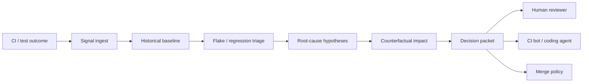

# Grant Evidence Package

Status: reviewer-facing evidence package.

Scope: this document summarizes the current LiminalQA artifact, reproducible reviewer path, evidence assets, explicit non-claims, and near-term research/product roadmap for grant reviewers, pilot customers, and technical evaluators.

## One-sentence claim

LiminalQA is an open-source QA decision intelligence system that turns raw CI/test outcomes into structured decision packets: flake/regression classification, merge policy, root-cause hypotheses, counterfactual impact, and human/agent-readable next actions.

## Core idea

LiminalQA sits between raw test results and engineering decisions.

```text
CI/test signal -> historical baseline -> flake/regression triage -> root-cause hypotheses -> merge policy -> decision packet
```

The goal is to reduce noisy CI investigation time and make QA failures legible to both humans and coding agents.

## Reviewer path

A reviewer can inspect the core demo locally:

```bash
cargo test -p liminalqa-core --test dashboard_demo -- --nocapture
```

General validation path:

```bash
cargo test
```

Docker path for environments where local Rust builds are difficult:

```bash
docker build -t liminalqa .
docker run -it --rm -v $(pwd)/data:/app/data -v $(pwd)/reports:/app/reports liminalqa
```

MVP-1 stack path:

```bash
docker compose -f deploy/docker-compose.mvp1.yml up -d
```

## Architecture at a glance



LiminalQA is not a test runner replacement. It is a decision layer that explains what the test results mean and what should happen next.

## Current evidence matrix

| Evidence asset | Reviewer question | Path / command | Current status |
| --- | --- | --- | --- |
| Dashboard demo | Can LiminalQA produce a human-readable decision packet? | `cargo test -p liminalqa-core --test dashboard_demo -- --nocapture` | Implemented demo |
| Core library | Are decision/risk/triage primitives implemented in Rust? | `liminalqa-core/` | Implemented |
| Case study: flaky CI | Does the project show a concrete flake-vs-bug decision story? | `docs/case-studies/flaky-ci-bottleneck.md` | Documented |
| Case study: regression | Does the project show pre-merge regression detection? | `docs/case-studies/regression-critical-path.md` | Documented |
| MVP quickstart | Can a reviewer run an MVP path? | `docs/MVP1_QUICKSTART.md` | Documented |
| Architecture docs | Is the system architecture described? | `docs/ARCHITECTURE.md` | Documented |
| Monitoring docs | Are operational metrics described? | `docs/monitoring/README.md` | Documented |
| Docker path | Is there a container-based setup route? | `Dockerfile`, `docker-compose.yml` | Present |
| API ingest model | Is there a path for external CI data ingestion? | README API endpoints / ingest service | Documented / implemented path |

## What is already implemented

- Rust core modules for QA decisions and reports.
- Dashboard-style decision packet demo.
- Flake / regression / triage framing.
- Merge policy and recommended-action vocabulary.
- Root-cause hypothesis presentation.
- Counterfactual “what-if” panel concept.
- Community-pattern matching concept and data structures.
- MVP quickstart path.
- Docker-based setup path.
- Monitoring documentation with Prometheus/Grafana orientation.
- Case studies that show how QA signals become decisions.

## What LiminalQA makes inspectable

LiminalQA is designed to make QA failure interpretation inspectable, including:

- whether a failure is more likely a flake or a new bug,
- whether a merge should be blocked, warned, retried, or allowed,
- which evidence contributed to a decision,
- what root-cause hypotheses are plausible,
- what counterfactual improvement is expected if a cause is fixed,
- which similar historical/community patterns match,
- what next action a human or coding agent should take.

## Product wedge

LiminalQA has a clearer commercial wedge than the lower-level research protocols:

```text
CI turns red -> team spends 30-60 minutes investigating -> LiminalQA returns a decision packet in seconds
```

Potential pilot users:

- teams with flaky CI,
- fintech/backend teams with high regression cost,
- teams adopting coding agents for PR fixes,
- QA/platform teams that need better merge-policy automation,
- engineering managers who need risk summaries rather than raw logs.

## Relationship to the Liminal Evidence Stack

LiminalQA is not the core causal oversight layer, but it can become an applied use case for the stack.

- **PythiaLabs:** can gate whether a coding agent should apply a CI fix.
- **DRP:** can record merge/block/retry decisions.
- **LTP:** can replay coding-agent or CI-autofix execution traces.
- **CML:** can audit whether a fix/action had valid authorization and responsibility lineage.
- **LiminalDB:** can store test timelines, decision packets, and historical QA signals.
- **LiminalQA:** turns CI/test signals into actionable quality decisions.

## What this project does not claim yet

LiminalQA currently does not claim:

- perfect root-cause identification,
- replacement of QA engineers,
- replacement of CI systems,
- production-grade statistical certainty for every project,
- universal flake detection across all languages/frameworks,
- certified compliance or safety guarantees,
- automatic safe merging without human policy controls,
- complete community knowledge base coverage.

The current value is narrower: a working open-source prototype and decision model for turning QA signals into structured merge/risk recommendations.

## Why this is grant/product-relevant

As coding agents become more common, CI failures increasingly become action triggers: retry, fix, revert, open PR, modify dependencies, or escalate. Raw test logs are not enough for safe automation.

LiminalQA contributes one applied decision primitive:

```text
test history + current failure + triage model -> structured decision packet -> human/agent action
```

This can support both research into agentic software engineering oversight and commercial pilots around CI decision intelligence.

## Research / build roadmap

Near-term work can focus on:

1. **Decision packet schema** — formalize the output shape for humans, CI bots, and coding agents.
2. **Evidence scoring** — make confidence, evidence weights, and uncertainty explicit.
3. **Benchmark corpus** — add reproducible flaky/regression/infra-failure scenarios.
4. **CI integrations** — GitHub Actions, GitLab CI, Jenkins, and local test pipelines.
5. **Agent gating** — connect LiminalQA decisions to PythiaLabs for pre-execution coding-agent actions.
6. **Temporal storage** — persist historical runs and decisions in a replayable evidence substrate.
7. **Pilot reports** — produce before/after metrics for investigation time, false blocks, regressions caught, and retry noise.

## Suggested reviewer checklist

A reviewer can ask:

- Can I run a demo and see a decision packet?
- Does the system distinguish flake vs regression vs infra/test-design issues?
- Does it produce a merge policy rather than only a raw score?
- Are uncertainty and non-claims explicit?
- Is there a credible path to CI integration?
- Is there a clear commercial pilot story?

## Current strongest positioning

Use this formulation in applications or outreach:

```text
LiminalQA is an open-source QA decision intelligence system that turns raw CI and test outcomes into structured decision packets: flake/regression classification, merge policy, root-cause hypotheses, counterfactual impact, and next actions for humans or coding agents.
```

## Short version

```text
CI shows red.
LiminalQA explains whether it is likely a flake, regression, infrastructure issue, or test-design problem.
Then it produces a merge policy and next action.
```
