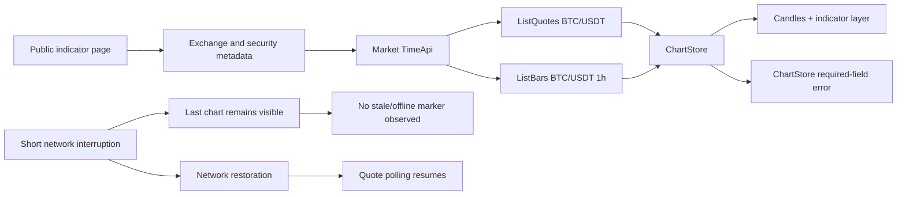

# LiminalQA · TakeProfit chart and quote causality audit

## Scope

Public BTC/USDT chart embedded in the published indicator page:

`https://takeprofit.com/indicator/atr-super-trend-multi-source-57`

The probe observed only requests initiated by the public page itself. It did not authenticate, call endpoints directly, place orders, fuzz inputs, generate load, or claim a security vulnerability.

## Evidence

- Workflow run: `29662910618`
- Exact workflow head: `27bf4fe23d8c63dcf6691ae7cf3b5f34b672e89c`
- Artifact digest: `sha256:2158374d653f5fd4e56bf96fa3489868a64b69c590fc0950dda1ac84c05f1105`
- Result SHA-256: `f8eccc551a033af8fbe1417803240c7c9d63988f4bccb47d4aa8bc3f285e7a89`
- Browser: Headless Chrome 150
- Viewport: 390 × 844
- Observation window: 2026-07-18T22:09:14Z–22:11:51Z

## Verdict

**WARN**

The public chart successfully obtains BTC security metadata, a current quote, and historical bars; quote bodies change over time, the data path resumes after a short network interruption, and the chart reconstructs after reload. However:

1. the ChartStore still initializes with missing required settings;
2. the user receives no observed stale/offline indication while the last chart remains visible;
3. the public chart relies on periodic HTTP quote polling rather than an observed continuous socket stream;
4. historical backfill and layer integrity remain unverified because the cookie-consent layer contaminated gesture evidence.

## Decision matrix

| Check | Verdict | Evidence |
|---|---|---|
| Chart boot | WARN | BTC/USDT chart rendered, but ChartStore validation failed |
| Quote bootstrap | PASS | `ListQuotes` and `ListBars` both returned 200 |
| Live quote activity | PASS | Four distinct binary quote bodies were captured |
| Reload recovery | PASS | BTC chart and bars loaded again after reload |
| Reconnect recovery | PASS | Two market-data events arrived after network restoration |
| Stale-state clarity | WARN | No `offline`, `stale`, `delayed`, `disconnected`, or reconnect state appeared |
| Historical regression | WARN | Missing ChartStore fields reproduced on first load and reload |
| History backfill | UNVERIFIED | No defensible left-pan evidence |
| Candle/indicator layer integrity | UNVERIFIED | Cookie surface intercepted part of the interaction run |

## Confirmed data path



The request payload identified `BTC/USDT` and the exchange code `CXBPOT`. The chart displayed the exchange as Bybit.

## Quote loading behavior

Observed calls:

- `QuoteApi/ListQuotes`: 5 requests;
- `ExtrapolationApi/ListBars`: 3 requests;
- `TimeApi/Time`: initial load and reload;
- 20 market-data response chunks;
- 74,196 response bytes;
- no WebSocket connection or frame observed.

Four `ListQuotes` response bodies had different SHA-256 digests. Therefore the quote source was not a fixed cached payload.

The first observed quote gaps were approximately:

| Interval | Gap |
|---|---:|
| Quote 1 → Quote 2 | 42.0 s |
| Quote 2 → Quote 3 | 59.7 s |

This supports a periodic HTTP polling model on the public indicator card. It does not prove the authenticated trading workspace uses the same transport.

## TP-CHART-STATE-01 · Incomplete ChartStore initialization

**Severity:** High  
**Status:** Confirmed  
**Regression verdict:** `STILL_PRESENT_IN_CHANGED_FORM`

The following error appeared immediately during first initialization and repeated immediately after reload:

```text
[ChartStore] settings.chart.timeToCloseLabel is a required field
settings.chart.style.lineSource is a required field
settings.chart.style.tpo is a required field
```

### Causal chain

```text
page bootstrap
→ default or persisted chart settings assembled incompletely
→ ChartStore schema validation fails
→ rendering continues with fallback or partial state
→ later chart behavior depends on degraded state
```

This is the same architectural family as the January 2026 findings involving missing `crosshairStyle`, `crosshairWidth`, `IndicatorManager.selected`, `indicators`, and `version` fields. The individual fields changed; the initialization contract remains violated.

### Product risk

- a visible chart may create a false sense that initialization completed cleanly;
- optional features can fail later when they access one of the missing settings;
- persisted settings, indicator pages, and full workspaces may diverge in behavior;
- repeated schema failures add noise that can hide a new production exception.

### Recommended fix

Create one versioned, schema-valid chart-settings constructor and migrate old persisted objects before ChartStore creation. Reject or repair incomplete state before rendering instead of validating after consumers already subscribe.

## TP-QUOTE-STATE-02 · Stale quote is not visibly distinguished

**Severity:** Medium  
**Status:** Confirmed for the tested public surface

During a five-second browser-level network interruption, the last BTC chart remained visible. No explicit `offline`, `stale`, `delayed`, `disconnected`, or reconnect state was observed.

### Causal chain

```text
network stops
→ no new quote is available
→ last successful chart remains plausible
→ user sees no freshness boundary
→ old price can be interpreted as current
```

For a trading-oriented product, silent freshness loss is more dangerous than an obvious blank state. A stale but plausible quote can influence timing, analysis, alerts, and trust.

### Recommended fix

Track the last successful market-data timestamp separately from page connectivity. Show a visible stale/delayed badge when quote age exceeds the expected polling or stream heartbeat, and clear it only after fresh symbol-matching data arrives.

## TP-QUOTE-TRANSPORT-03 · Polling cadence and temporal gaps

**Severity:** Informational with reliability implications  
**Status:** Confirmed for the tested public surface

No WebSocket traffic was captured. The page requested quotes repeatedly over HTTP gRPC-web. This is not inherently a bug, but it creates specific sensitive cases:

- timers can be throttled in background tabs;
- one delayed request can make the visible price older than expected;
- overlapping polls can apply responses out of order;
- reload or reconnect can create duplicate timers;
- quote and candle refresh cycles can temporarily disagree.

The client should attach symbol identity and monotonic server time to every state update and ignore responses older than the latest applied quote.

## Sensitive causal test portfolio

### 1. Quote–candle coherence

```text
latest quote Q(t)
→ current candle close C(t)
→ price-axis marker
→ header/legend value
```

Assert the same symbol, timestamp domain, precision, and source across all four displays. During an active candle, the quote and close may differ by design, but the UI must state the relationship consistently.

### 2. Out-of-order quote responses

```text
poll A starts
→ poll B starts
→ B returns newer quote
→ A returns older quote
```

Expected: A is discarded by server timestamp or sequence number. The visible value must never move backwards merely because requests completed out of order.

### 3. Symbol transition atomicity

```text
BTC selected
→ user selects ETH
→ old BTC bars still loading
→ ETH metadata arrives
→ old BTC response completes
```

Expected: header, quote, bars, indicators, precision, exchange, and alert context change atomically. Responses from the previous symbol must be ignored.

### 4. Reload restoration ordering

```text
persisted chart settings
→ security metadata
→ quote
→ bars
→ indicators
```

Expected: each layer waits for a schema-valid dependency set. No required-field errors and no indicator calculation against an undefined symbol or range.

### 5. Market-data interruption

Test intervals shorter and longer than the normal polling cadence. The UI should distinguish:

- connected and fresh;
- connected but delayed;
- reconnecting;
- offline with last-known value;
- no data for the selected market.

### 6. Historical backfill merge

```text
pan left
→ request older bars
→ merge into current series
→ preserve viewport anchor
```

Assert no duplicate timestamps, no gaps created by merge, strict chronological order, and identical indicator recomputation before and after the backfill boundary.

### 7. Time and session boundaries

For crypto and exchange-traded assets separately, test:

- minute/hour rollover;
- daily candle boundary;
- exchange timezone vs local timezone;
- DST change;
- market closed/open transitions;
- delayed feed vs real-time feed labeling.

### 8. Numeric correctness

Verify:

- tick-size rounding;
- decimal precision per instrument;
- negative and zero values where valid;
- very large values and scientific notation avoidance;
- percentage change denominator and session reference price;
- missing OHLC fields and null volume.

## Secondary signal

`GET /api/subs-platform/plans` returned `403` on both initial load and reload. This did not block the public BTC chart, so it is classified as secondary subscription-metadata noise rather than a chart failure. It should still be handled without noisy Console output if a public visitor is expected to access the page.

## What is not yet proven

- authenticated workspace streaming behavior;
- ticker switching inside the full platform;
- touch drag and resize;
- historical bar backfill;
- candle/indicator visual synchronization after pan;
- multiple linked chart synchronization;
- alert calculations based on the same feed;
- mobile PWA background/foreground restoration.

These require an authorized interactive session. The public evidence must not be generalized to those surfaces without a separate run.
