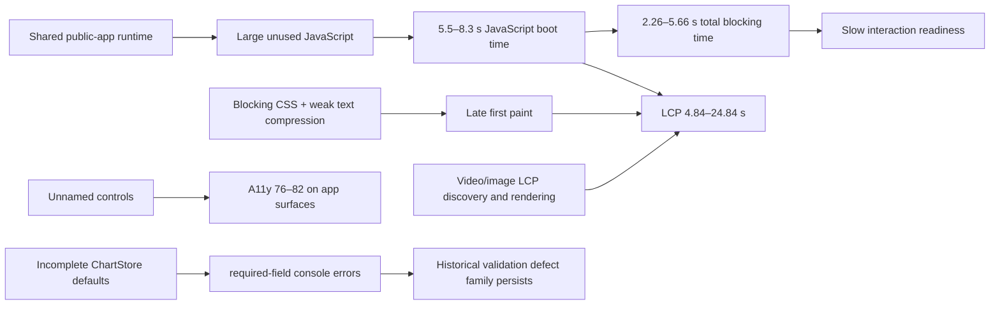

# LiminalQA · TakeProfit Lighthouse causality audit

**Verdict:** `WARN`  
**Evidence run:** `29661982911`  
**Exact head:** `a8890c785bcc8754d27aac5d9f5fd390e0f7b7b7`  
**Lighthouse:** `12.6.1`  
**Portfolio artifact:** `sha256:87083147b2868566f406ffd99b965531f636a422ddbce0010676b1cc9e4dc1fe`

## Executive result

Six public TakeProfit surfaces were measured with one passive mobile Lighthouse navigation each. All six returned `WARN`. Average Performance is **34**; LCP ranges from **4.84 s** to **24.84 s**. The five application/community surfaces share a very broad first-party JavaScript runtime, while the documentation uses a separate Next.js stack and still shows high main-thread blocking.

| Surface | Perf | A11y | Best | SEO | LCP | TBT |
|---|---:|---:|---:|---:|---:|---:|
| Homepage | 27 | 78 | 71 | 100 | 24.84 s | 2.26 s |
| Platform entry | 25 | 82 | 93 | 92 | 24.16 s | 4.42 s |
| Indicator catalogue | 38 | 78 | 89 | 100 | 7.00 s | 5.02 s |
| Indicator detail | 26 | 80 | 75 | 100 | 7.98 s | 4.66 s |
| Community feed | 45 | 76 | 75 | 100 | 4.84 s | 5.66 s |
| Documentation overview | 43 | 96 | 96 | 92 | 10.25 s | 4.46 s |

## Causal graph



## Confirmed cross-surface causes

1. **Runtime overdelivery.** JavaScript boot-time is reported on 6/6 targets. Unused JavaScript appears on 5/6, commonly led by `/_app/immutable/chunks/674oYVvK.js` with roughly **405–517 KiB** unused per application surface.
2. **Main-thread blocking.** TBT is between **2.26 s and 5.66 s**. The feed has the fastest LCP but the worst TBT, showing that visual arrival does not mean interaction readiness.
3. **Late media/content paint.** Homepage and platform LCP are both video elements and exceed **24 s**. On the platform, Lighthouse reports that the LCP request is not discoverable in the initial document and lacks a high-priority hint.
4. **Blocking delivery.** Render-blocking CSS and missing text compression recur on 5/6 targets.
5. **Accessibility debt.** Unnamed-button failures occur across the five application/community surfaces; the homepage alone exposes **136** failing button nodes in this run.
6. **Separate docs stack, similar CPU problem.** Documentation shares none of the application first-party script paths, yet records **4.46 s TBT**, so it has an independent bundle/runtime problem rather than merely inheriting the trading shell.

## Current regression evidence against the January 2026 audit

On the published indicator page, the current public browser run logs:

```text
[ChartStore] settings.chart.timeToCloseLabel is a required field
settings.chart.style.lineSource is a required field
settings.chart.style.tpo is a required field
```

The January audit recorded missing `crosshairStyle` and `crosshairWidth`, plus repeated required-field failures in `IndicatorManager`, `DrawingManager`, and related state objects. The exact fields have changed, but the **same initialization/validation defect family remains observable**. The correct verdict is therefore `STILL_PRESENT_IN_CHANGED_FORM`, not proof that every historical defect remains.

| Historical cluster | Current evidence | Verdict |
|---|---|---|
| Indicator/Chart required fields (#1, #5, #8, #11) | New ChartStore required-field errors on a published indicator page | `STILL_PRESENT_IN_CHANGED_FORM` |
| `undefined.info` after mobile refresh (#12) | Not observed in passive unauthenticated Lighthouse navigation | `UNVERIFIED` |
| Mobile drag, Explore overlay, clipped filters (#2–4) | Lighthouse cannot execute the historical touch interaction sequence | `UNVERIFIED` |
| Report modal and 200-character validation (#6–7) | Requires authenticated interactive form flow | `BLOCKED_BY_SCOPE` |
| Drawing Z-order and alert deletion (#9–10) | Requires workspace state and authenticated actions | `BLOCKED_BY_SCOPE` |
| Community post scroll layout (#13) | Feed has low CLS in this single navigation, but the historical scroll sequence was not executed | `UNVERIFIED` |

## Recommended fix order

1. **Make chart state construction total:** provide versioned defaults for every ChartStore/IndicatorManager field, validate once at the boundary, and refuse to render partial state.
2. **Split the public shell from trading runtime:** route-level code splitting and delayed loading of chart/editor/community modules.
3. **Fix LCP media strategy:** expose the real mobile poster/media in initial HTML, add appropriate priority, and avoid making an autoplay video the critical first-paint dependency.
4. **Compress text assets and reduce render-blocking CSS.**
5. **Name every icon-only control** with visible text or an accessible name.
6. **Add CI budgets:** Performance ≥65, TBT ≤600 ms, no required-field Console errors, and zero unnamed primary controls.

## Evidence boundary

This is passive public-page QA evidence. It does not authenticate, access private data, call application APIs, submit reports, create alerts, place trades, fuzz endpoints, run load tests, or claim a security vulnerability. A single Lighthouse run is a reproducible snapshot, not proof of long-term production stability.
