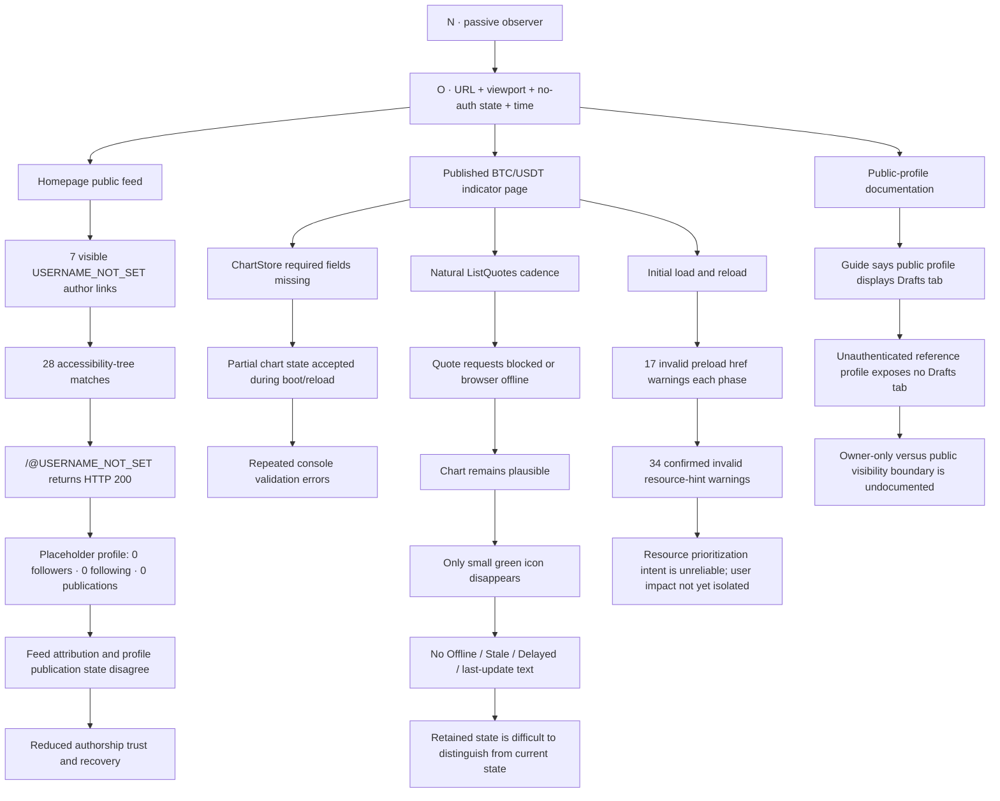

# TakeProfit public recheck — 2026-07-20

## Executive verdict

A bounded public, unauthenticated recheck was performed with the same browser workflows used for the earlier TakeProfit report, plus a new coordinate-centered identity and documentation probe.

- The three previously submitted defect families remain reproducible.
- One new public content-integrity defect is confirmed: the literal sentinel `USERNAME_NOT_SET` is exposed as the author of public feed cards and links to a valid placeholder profile reporting zero publications.
- One new technical markup defect is confirmed: 34 repeated invalid-preload-URL console warnings across initial load and reload.
- The public-profile guide contains a confirmed visibility ambiguity around the Drafts tab; no private-draft exposure is claimed.
- The fresh six-surface portfolio remains `WARN` on all targets with average Performance `33.2`.
- Two large performance deltas are treated as directional regression signals, not stable field regressions, because each target has one current laboratory navigation.

## Safety boundary

The audit used only allowlisted public pages and browser-local observation or network treatment.

It did not:

- authenticate or access an account;
- read private portfolio, alerts, drafts, or personal data;
- call application APIs directly;
- submit forms or modify server state;
- perform financial operations;
- fuzz, exploit, or load test;
- claim a security vulnerability or regulatory violation.

## Center of coordinates and observer

```text
O = {
  public URL,
  browser profile,
  viewport,
  unauthenticated state,
  observation time,
  natural page state
}

N = passive unauthenticated browser observer
```

Axes:

- `X` — domain → route → component → author/quote state → linked destination;
- `Y` — booting → rendered → accessible → live-looking → stale/disconnected → recovered;
- `Z` — desktop/mobile or bounded browser-local treatment;
- `T` — navigation → settled page → quote cadence/outage → restore/reload.

## Causal-space-time graph



## Old report → current result

| Previously submitted finding | Current evidence | Status |
|---|---|---|
| `ChartStore` missing required fields | Same three-field signature reproduced on initial load and reload | `REPRODUCED_AGAIN` |
| Quote connection loss communicated only by a small green icon | Three new paired runs reproduce the same bounded visual difference; chart and body text remain | `REPRODUCED_AGAIN` |
| No textual freshness boundary during prolonged network loss | Three fresh browser-offline rounds of 90.412 s, 105.445 s, and 120.514 s retain the chart with no freshness marker; recovery passes | `REPRODUCED_AGAIN` |
| Older-after-newer transport ordering may affect visible chart state | Fresh delayed-response run again creates older-after-newer delivery; visible price rollback remains unproven | `NEEDS_EVIDENCE` |
| Steady-state quote application order | Three 90 s holds receive no later non-empty response, so application order cannot be adjudicated | `NOT_TESTABLE_IN_CURRENT_CADENCE` |

## Confirmed new finding: public sentinel identity

**ID:** `TP-PUBLIC-IDENTITY-01`  
**Severity candidate:** `P2 public content integrity`  
**Confidence:** `HIGH`

Desktop and mobile independently show:

- seven body-text occurrences of `USERNAME_NOT_SET`;
- seven visible author links;
- 28 accessibility-tree matches;
- one destination: `https://takeprofit.com/@USERNAME_NOT_SET`.

The destination returns HTTP 200 and presents a real public-facing placeholder profile titled `USERNAME_NOT_SET`, with:

- `0 Followers`;
- `0 Following`;
- `0 Publications`.

At the same time, the homepage displays public post cards attributed to that identity. The bounded inconsistency is therefore:

```text
public feed cards attributed to sentinel identity
→ author link resolves successfully
→ destination profile reports zero publications
→ feed attribution and profile state disagree
```

The likely origin is an incomplete or missing username state escaping into publication metadata, but this root cause is a hypothesis. No account compromise, private-data disclosure, or identity takeover is claimed.

### Expected behavior

A public post must be associated with a stable display identity and a profile state that consistently represents the author’s public publications. If the original account no longer has a valid public identity, the UI should use an explicit neutral state such as `Deleted user` rather than an internal sentinel value.

## Confirmed new finding: invalid preload URLs

**ID:** `TP-PUBLIC-PRELOAD-02`  
**Severity candidate:** `P3 technical/performance`  
**Confidence:** `HIGH for console defect; LOW for user impact`

The fresh public BTC/USDT chart probe records exactly 34 browser warnings:

```text
<link rel=preload> has an invalid `href` value
```

Temporal distribution:

- 17 warnings during initial load;
- 17 warnings after reload.

This proves repeated malformed or empty preload hints in the rendered page lifecycle. It does not by itself prove a specific LCP penalty, missing visible asset, or failed user action. A DOM-to-resource counterfactual is required before assigning performance impact.

## Confirmed documentation ambiguity

**ID:** `TP-PUBLIC-DOC-03`  
**Severity candidate:** `P3 documentation`  
**Confidence:** `HIGH`

The guide describes a profile as public and then says the profile page displays draft posts and indicators in a Drafts tab. An unauthenticated reference profile does not show such a tab.

The likely intended behavior is that Drafts is owner-only, but the guide does not state this boundary. The finding is documentation ambiguity only. No public exposure of drafts was observed or claimed.

## Fresh public performance portfolio

| Surface | Perf | A11y | Best | SEO | LCP | TBT | Verdict |
|---|---:|---:|---:|---:|---:|---:|---|
| Homepage | 27 | 78 | 71 | 100 | 21.17 s | 2.60 s | WARN |
| Platform | 29 | 81 | 75 | 92 | 19.41 s | 4.51 s | WARN |
| Indicators | 30 | 76 | 71 | 100 | 16.29 s | 1.72 s | WARN |
| Indicator detail | 26 | 80 | 75 | 100 | 8.76 s | 7.98 s | WARN |
| Feed | 43 | 78 | 93 | 100 | 4.62 s | 5.51 s | WARN |
| Documentation | 44 | 96 | 96 | 92 | 10.44 s | 4.40 s | WARN |

Portfolio summary:

- six of six targets: `WARN`;
- average Performance: `33.2`;
- fastest LCP: `4.62 s`;
- slowest LCP: `21.17 s`;
- JavaScript boot-time finding: `6/6`;
- render-blocking resources: `5/6`;
- missing text compression: `5/6`;
- unnamed-button accessibility finding: `5/6`;
- console errors: `4/6`.

### Directional comparison with the 2026-07-18 snapshot

The comparisons below are two single-run laboratory snapshots. They are useful for selecting the next experiment, not for claiming a stable production trend.

| Surface | Previous | Current | Interpretation |
|---|---:|---:|---|
| Homepage LCP | 24.84 s | 21.17 s | directional improvement |
| Platform LCP | 24.16 s | 19.41 s | directional improvement |
| Indicators LCP | 7.00 s | 16.29 s | `NEW_DIRECTIONAL_REGRESSION_SIGNAL` |
| Indicator detail TBT | 4.66 s | 7.98 s | `NEW_DIRECTIONAL_REGRESSION_SIGNAL` |
| Feed LCP | 4.84 s | 4.62 s | broadly stable |
| Documentation LCP | 10.25 s | 10.44 s | broadly stable |

The highest-value next performance experiment is a repeated same-runner comparison on `/indicators` and the indicator detail page, separating resource discovery, script boot, long tasks, and server response timing.

## Candidate signals not promoted to defects

### Public subscription plans request returns HTTP 403

The public chart naturally requests `https://takeprofit.com/api/subs-platform/plans` and receives HTTP 403 during initial load and reload. The intended product contract and visible user impact are unknown, so this remains `NEEDS_EVIDENCE`.

### Termly resource-blocker order warning

The console reports that the Termly ResourceBlocker is not the first script and might not block unapproved content. This is a tooling warning, not proof of an actual consent-order failure or legal violation. A separate request-timeline and cookie-state experiment would be required.

### Duplicate footer legal links

Two `Terms of Use` and two `Privacy Policy` anchors are present in the homepage DOM for both profiles. Whether hidden responsive duplicates remain in the accessibility tree and create navigation duplication requires a focused accessibility probe.

## Rejected and bounded claims

The evidence does **not** support claims that:

- the displayed BTC price is incorrect relative to an external market;
- the chart visibly rolls back to an older price;
- ChartStore validation and freshness signaling share one root cause;
- the placeholder identity exposes private account data;
- drafts are publicly exposed;
- the Termly warning proves a privacy or regulatory violation;
- one successful workflow run alone proves any defect.

## Priority order

### P2

1. Replace the public `USERNAME_NOT_SET` identity with a stable user identity or explicit deleted-user state and reconcile the linked publication count.
2. Add a persistent, accessible quote-freshness contract: `Live`, `Delayed`, `Offline`, `Reconnecting`, and last-update timestamp.
3. Make ChartStore construction total and versioned so partial required state cannot enter rendering.

### P3

1. Remove invalid preload URLs and validate resource hints in CI.
2. Clarify owner-only Drafts visibility in public-profile documentation.
3. Review duplicated responsive legal links in the accessibility tree.

## Evidence preservation

Canonical machine-readable reports are committed beside this document:

- `audits/browser/takeprofit/public-identity-result-2026-07-20.json`;
- `audits/browser/takeprofit/public-chart-recheck-2026-07-20.json`;
- `audits/lighthouse/takeprofit/public-recheck-2026-07-20.json`.

The exact run and artifact map is stored in `docs/audits/TAKEPROFIT_EVIDENCE_INDEX.md`.

Artifacts contain raw JSON, Markdown summaries, screenshots, and SHA-256 manifests. Canonical conclusions remain in Git so the audit does not depend solely on temporary Actions retention.
