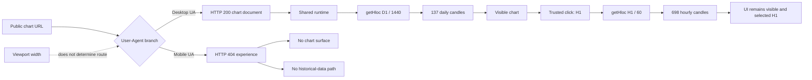

# Tradernet public chart and quote causal audit

## Scope

This audit examines one public chart page and one reviewed index:

```text
https://tradernet.ru/charts/MICEXINDEXCF
```

It is intentionally bounded to passive browser behavior and one visible interval transition. It does not authenticate, call the application API directly, subscribe to market depth, access a portfolio, or submit financial operations.

## Executive result

The audit confirmed one high-impact product defect:

> The public chart route succeeds for desktop user-agents but returns the Tradernet 404 page for mobile user-agents, regardless of viewport width.

The tested desktop chart path otherwise loaded structurally valid daily and hourly candle history. The trusted `D1 → H1` transition changed both the visible UI state and the naturally initiated `getHloc` request.

## Space-time causal graph



## Confirmed defect: mobile user-agent route

Evidence run: `29662815487`  
Exact head: `0a4e364bc311b548c551a33b30adf9302872ab2b`

| User-agent | Viewport | Result |
|---|---|---|
| Desktop | Desktop | HTTP 200; chart visible |
| Desktop | Mobile-sized | HTTP 200; chart visible |
| Mobile | Desktop-sized | HTTP 404; no chart |
| Mobile | Mobile-sized | HTTP 404; no chart |

**Causal verdict:** `USER_AGENT_ROUTING_CONFIRMED`

The failure follows the user-agent, not the viewport. This makes a pure responsive-layout explanation unlikely. The likely defect lies in server-side or early client-side device routing for the public chart route.

### User impact

A phone browser cannot open the public chart link even though the same resource is available to a desktop browser. The failure happens before chart rendering and before historical candles are loaded.

### Recommended fix

1. Route mobile user-agents to the same public chart document or an explicit supported mobile chart route.
2. Preserve the ticker during any redirect.
3. Return a product-level unsupported-state explanation only when mobile charts are intentionally unavailable; do not use the generic 404 page.
4. After the route is corrected, execute a real mobile responsive regression for chart width, price-axis labels, controls and drawing tools.

## Passed: daily historical-data integrity

Evidence run: `29662815487`  
Artifact: `tradernet-hloc-integrity-29662815487`

The public chart naturally requested:

```text
interval: D1
timeframe: 1440
ticker: MICEXINDEXCF
```

Observed response:

| Candles | Timestamps | Volumes | Violations |
|---:|---:|---:|---:|
| 137 | 137 | 137 | 0 |

Checked invariants:

- `high >= low`;
- open and close within the candle range;
- finite positive OHLC values;
- equal HLOC/timestamp/volume lengths;
- unique, strictly increasing timestamps;
- finite, non-negative volume.

No historical-data integrity defect was confirmed for this ticker and interval.

## Passed: daily-to-hourly transition

Evidence run: `29663112769`  
Exact head: `b8e228aa2273a9e8f01b4d4c4c105c0781d8e63b`

The audit used one visible Puppeteer mouse click on the exact public option:

```text
.js-selectInterval .js-chart-click[data-value="H1"]
```

| Phase | UI | Timeframe | Interval | Candles | Violations |
|---|---|---:|---|---:|---:|
| Initial | Дневной | 1440 | D1 | 137 | 0 |
| After click | Часовой | 60 | H1 | 698 | 0 |

**Verdict:** `TRANSITION_PASS`

This rejects the earlier synthetic-click false positive. Under the tested desktop path, the interval control, request parameters, data response and visible chart state remained consistent.

## Signals that require another experiment

### 1. Slow first visible chart

In the first bounded desktop run, a visible chart surface was detected after approximately `7.48 s`.

This is a single-run latency signal, not a stable performance verdict. The next experiment should measure three cold runs and split the timeline into:

```text
document response
→ runtime ready
→ getHloc request
→ getHloc response
→ first non-empty chart canvas
```

### 2. `ERROR: No context for render`

The console emitted:

```text
ERROR: No context for render
```

The chart still rendered. Therefore the user impact is not established. The message should be correlated with canvas layers, resizes, multiple-chart layouts and interval transitions before being filed as a separate defect.

### 3. Narrow-view visual crowding

With a desktop user-agent and mobile-sized viewport, the chart technically rendered, but the vertical drawing toolbar consumed a significant part of the plot and crowded the right price axis. This is a latent responsive candidate, not the primary real-mobile behavior, because an actual mobile user-agent currently receives the 404 route.

### 4. Malformed minute labels

The rendered dropdown DOM contained these option labels:

```text
минутный > Д
5 минутный > 3Д
15 минутный > Н
```

The entries look truncated or incorrectly templated. A trusted-click screenshot with the menu visibly open is required before classifying this as a user-visible localization bug.

## Live quote loading: not assessed yet

The evidence was collected during a UTC weekend. No real-time quote frames were observed, but absence of updates outside an active market session is not a defect.

A market-open experiment should measure:

1. document ready → first quote;
2. historical chart ready → first live update;
3. update cadence and timestamp monotonicity;
4. stale-data threshold and visual stale state;
5. market-close transition;
6. reconnect after a local offline/online cycle;
7. absence of duplicate or out-of-order updates after reconnect.

## Other high-value causal cases

### Symbol-switch race

```text
select A
→ A history request starts
→ select B
→ B history request finishes
→ late A response arrives
```

Expected: B remains selected and A cannot overwrite the chart, headline price or instrument metadata.

### Interval-switch race

```text
D1 request
→ select H1
→ select D1
→ responses arrive out of order
```

Expected: only the response matching the current selected interval may update the chart.

### Cross-surface consistency

Compare only observations with aligned timestamps and session semantics:

```text
headline last price
↔ chart latest value
↔ latest completed candle close
↔ bid / ask
↔ market status
```

Potential invariants include `bid <= ask`, last price within day high/low, and percentage change matching previous close. Authenticated or direct quote work requires a separate authorized scope.

### Session and timezone boundaries

Test several instrument classes around:

- exchange open and close;
- premarket and aftermarket;
- holidays;
- daylight-saving transitions;
- weekend boundaries.

Expected: no phantom candles, duplicated timestamps, missing session segments or false “live” state.

## Rejected false positives

Two audit-side false positives were explicitly rejected:

1. An aborted Google Analytics request was initially grouped with data failures. It is not a market-data dependency.
2. A broad synthetic click failed to change the interval. A later exact trusted mouse click completed the `D1 → H1` transition successfully.

This separation is part of the LiminalQA contract: detector errors and product defects must not be merged into one verdict.

## Evidence index

| Evidence | Run | SHA-256 |
|---|---:|---|
| Initial chart/quote observation | 29662674360 | `4a93f7c93a668d88369414500ff3e860b433b91eb9a32256ee69b12541b1e305` |
| Route causal matrix | 29662815487 | `223d10431960d0ca5fe181fbf22fe238e408ff72188ddb8daaca2d7e67d71395` |
| Daily HLOC integrity | 29662815487 | `591f9c5f286478eec7d037e59f1c9d58e17187193520796287c2a474d47359a4` |
| Interval DOM discovery | 29662973725 | `77f03dc492eda0c2ce4e323dd0a1bc57269c53d5b43f99f9b8d5af1bb490ff99` |
| Trusted D1 → H1 transition | 29663112769 | `ae749e087bbeac5d98ae63c7452835692bb2ee8f91a0862f3abfa04723fdb92f` |
