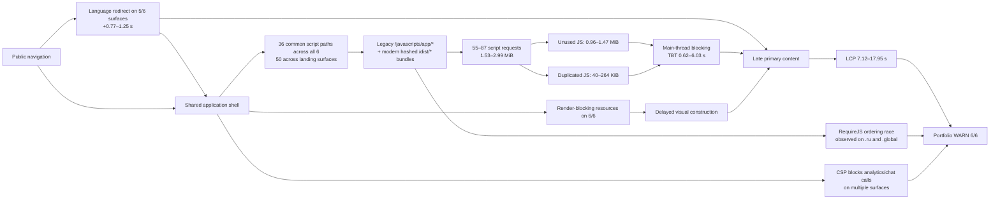

# LiminalQA · Tradernet cross-domain space-time causality graph

## Evidence binding

- Workflow run: `29661088488`
- Exact head: `dd07fd83c91fe98150f4730adccd8864478a9172`
- Portfolio artifact digest: `sha256:a950e15191d2486839a75674082cf5fe9985a76d01cc6834bcf3ee4427f72b68`
- Collection window: `2026-07-18T21:11:05Z` → `2026-07-18T21:13:08Z`
- Targets: 6 public surfaces
- Result: 6 × `WARN`

The machine-readable graph is stored in `audits/lighthouse/tradernet/portfolio-causality.json`.

## Executive finding

The portfolio does not show six unrelated page problems. It shows a shared platform-level quality path:

- all six surfaces share **36 exact first-party script paths**;
- the five landing surfaces share **50 exact first-party script paths**;
- every surface reports unused JavaScript, duplicated JavaScript, and render-blocking resources;
- every surface produces a LiminalQA `WARN`;
- average Performance is **33.8/100**;
- LCP ranges from **7.12 s to 17.95 s**.

This confirms shared frontend/runtime reuse. It does not by itself prove common legal ownership or authorize active security testing.

## Causality graph

## Space map

| Spatial layer | Observed problem | Cross-domain effect |
|---|---|---|
| Edge / routing | Five roots redirect to `?site_lang=...` | Every cold navigation begins with avoidable delay |
| Shared application shell | 36 identical first-party scripts across all six surfaces | Platform debt propagates between regions |
| Legacy runtime | `/javascripts/app/*`, RequireJS, older shared services | More requests and ordering risk |
| Modern bundle layer | Hashed `/dist/*` chunks load alongside legacy scripts | Duplicate code and overdelivery |
| Document head | Render-blocking resources on every surface | FCP/LCP delayed before useful content stabilizes |
| Main thread | TBT ranges from 615 ms to 6,033 ms | Slower interaction and rendering |
| Responsive media | LCP prioritization and responsive-image findings repeat | Above-fold content appears late |
| Third-party integrations | CSP blocks configured analytics/chat connections | Console noise and Best Practices degradation |
| Regional surface | Different integrations and page composition | Same shared debt produces different severity |

## Time map

| Surface | Performance | FCP | LCP | TBT | CLS | Key temporal bottleneck |
|---|---:|---:|---:|---:|---:|---|
| `rc.tradernet.com` FAQ | 16 | 9.75 s | 17.95 s | 2.86 s | 0.228 | Render-blocking opportunity ≈ 8.16 s |
| `translate.tradernet.com` | 25 | 3.13 s | 15.50 s | 6.03 s | 0.135 | Heaviest main-thread blocking |
| `tradernet.global` | 31 | 2.51 s | 14.37 s | 3.33 s | 0.115 | Runtime work plus late content |
| `tradernet.ru` | 34 | 2.06 s | 12.67 s | 2.58 s | 0.141 | Shared JS, redirect, late hero; RequireJS error observed |
| `tradernet.com` | 42 | 1.38 s | 7.12 s | 1.07 s | 0.169 | Fastest LCP, but runtime/integration debt remains |
| `tradernet.am` | 55 | 1.25 s | 13.09 s | 0.62 s | 0.111 | Cleaner runtime, but primary content remains late |

## Strongest causal conclusions

### 1. Shared runtime overdelivery is confirmed

Five landing domains share 50 exact script paths. All six surfaces share 36, including legacy application services and shared runtime files. Script transfer ranges from 1.53 to 2.99 MiB, while Lighthouse estimates 0.96 to 1.47 MiB of unused JavaScript per surface.

**Conclusion:** regional pages inherit a broad platform runtime even when the page needs only a small landing or article experience.

### 2. The FAQ surface likely combines two application shells

The FAQ page has:

- 87 script requests;
- 2.99 MiB of scripts;
- 1.47 MiB estimated unused;
- 263.5 KiB duplicated;
- a modern FAQ bundle and a large set of shared/legacy scripts;
- an 8.16-second render-blocking opportunity.

**Derived hypothesis:** the article application is composed on top of, rather than instead of, the broad trading-platform shell.

### 3. Redirect delay is systemic

Five of six root targets redirect to a language-specific query parameter. Measured redirect impact ranges from roughly 0.77 to 1.25 seconds.

**Conclusion:** direct canonical language URLs are a low-risk, cross-domain optimization.

### 4. RequireJS race is intermittent, not universal

`ReferenceError: require is not defined` was captured on `.ru` and `.global`, but not on every domain in this run.

**Conclusion:** this is consistent with an ordering/timing race. It is not yet proof that a visible feature breaks.

### 5. Integration configuration and CSP disagree

Several domains attempt analytics, chat, or WebSocket connections that the active Content Security Policy blocks.

**Conclusion:** either the integrations are no longer required and should not initialize, or CSP and the configured integrations are out of sync. This is a Best Practices defect, not automatically a security vulnerability.

## Counterfactual test sequence

1. **Bypass the language redirect.** Run three paired samples against `/` and the final `?site_lang=` URL.
2. **Build a landing-only runtime.** Remove trading-terminal services from one staging landing and compare script bytes, TBT and LCP.
3. **Deduplicate modules.** Apply Lighthouse duplicate-module findings and compare transfer/parse cost.
4. **Prioritize responsive LCP media.** Put the correct image in initial HTML with high fetch priority.
5. **Slim the FAQ shell.** Keep only article rendering, navigation and required analytics; defer noncritical CSS.
6. **Guard RequireJS initialization.** Repeat ten lightweight navigations and measure error frequency.
7. **Align CSP and integrations.** Disable obsolete calls or explicitly allow the intended endpoints, then verify console cleanliness.

## Recommended execution order

| Priority | Change | Expected reach |
|---:|---|---|
| 1 | Landing-only bundle and removal of unused shared services | Five landing surfaces |
| 2 | FAQ shell separation and critical CSS | Worst surface |
| 3 | Direct language URLs | Five surfaces |
| 4 | LCP image discovery and prioritization | At least four surfaces |
| 5 | RequireJS ordering guard | `.ru`, `.global`, possibly intermittent elsewhere |
| 6 | CSP/integration cleanup | Multiple international surfaces |

## Boundary

This report is based on one passive Lighthouse navigation per allowlisted public target with at most two targets running concurrently. It includes no authentication, private data, API testing, trading operations, fuzzing, load testing, exploitation, or vulnerability claim.
