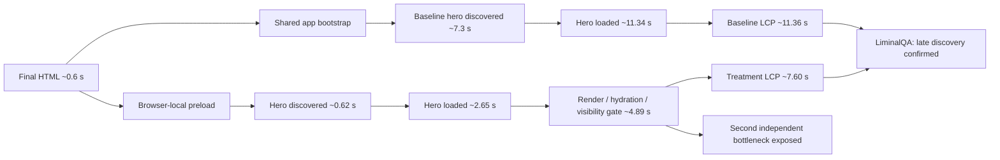

# Tradernet hero preload counterfactual

## Question

Is the approximately 11–12 second mobile LCP primarily caused by late discovery of the desktop hero image, or is the image discovered early and delayed only by rendering?

## Method

The experiment used the exact public Russian-language page:

```text
https://tradernet.ru/?site_lang=ru
```

Two variants were alternated for three rounds on the same GitHub-hosted Chrome instance:

1. **Baseline** — unmodified public navigation.
2. **Hero preload** — the browser intercepted the received public HTML at the CDP response stage and inserted one exact same-origin tag:

```html
<link
  rel="preload"
  as="image"
  href="https://tradernet.ru/images/2022/invest/hero.light.2x.webp"
  fetchpriority="high"
>
```

The interception happened after the original response passed through the browser's configured mobile network. No alternative Node-side fetch was used, because that would bypass browser throttling and create false acceleration.

Each run used:

- a fresh browser context;
- disabled cache;
- the same mobile viewport and user agent;
- the same emulated 3G network;
- the same CPU throttling;
- 15 seconds of post-load observation.

## Result

**LiminalQA verdict:** `SUPPORTED`  
**Confidence:** `MEDIUM`  
**Evidence run:** `29661704633`  
**Exact head:** `74590ddc0839227f28ff69678c82f76b84d6d86a`

| Median metric | Baseline | Browser-local preload | Effect |
|---|---:|---:|---:|
| Hero request begins | 7,321.9 ms | 617.1 ms | **−6,704.8 ms** |
| Hero response completes | 11,340.0 ms | 2,652.9 ms | **−8,687.1 ms** |
| LCP | 11,360.0 ms | 7,596.0 ms | **−3,764.0 ms / −33.13%** |
| Hero loaded → LCP | 20.0 ms | 4,890.2 ms | +4,870.2 ms |
| FCP | 7,376.0 ms | 7,596.0 ms | +220.0 ms |
| Long-task total | 1,198.0 ms | 1,216.0 ms | +18.0 ms |
| Script transfer | 1,277,150 bytes | 1,277,150 bytes | unchanged |
| Script requests | 56 | 56 | unchanged |

Every treatment run:

- injected exactly one preload at the response stage;
- requested the hero with initiator type `link`;
- produced the same LCP image and element as the baseline;
- completed without navigation or interception errors.

## Causal conclusion

Late image discovery is a material cause of the bad LCP.

```text
Baseline
HTML response
  → broad app/runtime work
  → hero discovered around 7.3 s
  → hero loaded around 11.3 s
  → LCP around 11.36 s

Preload treatment
HTML response
  → hero requested around 0.62 s
  → hero loaded around 2.65 s
  → runtime/visibility gate continues
  → LCP around 7.60 s
```

The preload removes approximately 6.7 seconds from request discovery and improves LCP by approximately 3.76 seconds. Script count, script transfer and long-task time remain unchanged, so the improvement is attributable to resource scheduling rather than reduced JavaScript.

However, the treatment exposes a second bottleneck:

> The hero is fully downloaded by approximately 2.65 seconds but does not become LCP until approximately 7.60 seconds.

That approximately 4.89-second post-load gap is consistent with one or more of:

- late insertion of the desktop hero element;
- hydration or client reconciliation;
- CSS visibility or animation gating;
- responsive variant replacement;
- main-thread work delaying the paint opportunity.

## Updated space-time causal graph



## Recommended fix order

1. Put the correct responsive LCP image in the initial HTML.
2. Add `fetchpriority="high"` or an exact preload for the image that is actually used as mobile LCP.
3. Stop transferring both mobile and desktop hero variants in one mobile navigation.
4. Instrument DOM insertion, style visibility and hydration timing to explain the remaining 4.89 seconds.
5. Reduce the broad shared application bootstrap after the critical image path is corrected.

## What this does not prove

The browser-local treatment estimates potential direction and magnitude. It does not prove that production deployment will produce exactly the same 33% improvement. Tradernet must implement the change and repeat the same evidence protocol against the deployed build.

It is not a security finding or penetration test.

## Evidence

Artifact:

```text
tradernet-hero-preload-counterfactual-29661704633
sha256:1b13ec0135eacbf2ac622963e616f06b0cd608a4723fe5788bdb56bb1bc327ec
```

Machine-readable result:

```text
audits/lighthouse/tradernet/hero-preload-counterfactual-result.json
```
