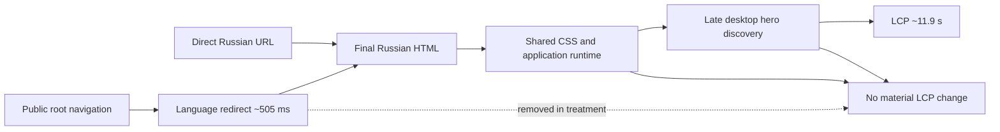

# Tradernet redirect counterfactual

## Question

Does bypassing the public root redirect materially improve the mobile loading experience?

```text
A: https://tradernet.ru/
   -> https://tradernet.ru/?site_lang=ru

B: https://tradernet.ru/?site_lang=ru
```

Both variants were measured three times on the same GitHub-hosted runner using the same Lighthouse configuration. The experiment used only passive public navigation.

## Result

**LiminalQA verdict:** `MIXED_SUPPORT`  
**Confidence:** `MEDIUM`  
**Exact evidence run:** `29661477160`  
**Exact head:** `8a9018972c23dbef0c3c5bf4df029b4bb9ee1ee5`

| Median metric | Root with redirect | Direct language URL | Effect |
|---|---:|---:|---:|
| Redirect duration | 505 ms | 0 ms | **−505 ms** |
| FCP | 2,098.96 ms | 2,093.13 ms | −5.83 ms |
| LCP | 11,867.90 ms | 11,893.80 ms | +25.90 ms |
| Speed Index | 3,983.75 ms | 3,940.85 ms | −42.90 ms |
| TBT | 672.50 ms | 668.00 ms | −4.50 ms |
| CLS | 0.131 | 0.131 | unchanged |
| Performance | 50 | 50 | unchanged |

## Causal conclusion

The direct URL removes a real median redirect step of approximately **505 ms**. However, the user-visible milestones remain effectively unchanged:

- FCP improves by only 0.28%;
- Speed Index improves by 1.08%;
- TBT improves by 0.67%;
- LCP is 25.9 ms slower, which is negligible relative to the run-to-run variance;
- Performance, Accessibility, Best Practices and SEO scores are unchanged.

Therefore:

> The language redirect is technical debt, but it is not the dominant cause of Tradernet's approximately 12-second mobile LCP.

The saved time is absorbed or overshadowed by later stages: shared application bootstrap, main-thread work, responsive hero reconciliation and late LCP discovery.

## Updated causal graph



The counterfactual weakens the earlier idea that the redirect is a high-leverage performance fix. It strengthens the shared-runtime and late-LCP-discovery explanations.

## Next bounded experiment

Keep the exact direct language URL constant and test two independent hypotheses:

1. **Late hero discovery:** measure the gap between final HTML completion, mobile hero request, desktop/LCP hero request and LCP across repeated runs.
2. **Broad shared JavaScript bootstrap:** compare the landing page's first-party runtime path set and main-thread cost with a lighter public surface.

These tests should remain diagnostic and passive. Browser-local modifications can estimate potential improvement, but they must not be presented as production behavior until Tradernet implements and retests the change.

## Evidence boundary

- six passive public navigations;
- no login or account data;
- no application API calls;
- no financial operations;
- no fuzzing, exploitation or load testing;
- laboratory evidence only, not a field-performance claim.

Artifact digest:

```text
sha256:a2a4d06525957015e7d84d5cbf9a7176970dc7110768a8d012b8bae67b2b825f
```
