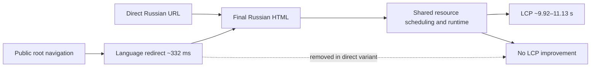

# Tradernet redirect counterfactual

## Question

Does bypassing the public root redirect materially improve the mobile loading experience?

```text
A: https://tradernet.ru/
   → https://tradernet.ru/?site_lang=ru

B: https://tradernet.ru/?site_lang=ru
```

Both variants were measured three times on the same GitHub-hosted runner using the same Lighthouse configuration. The experiment used only passive public navigation.

## Result

**LiminalQA verdict:** `NOT_SUPPORTED`  
**Confidence:** `MEDIUM`  
**Exact evidence run:** `29685629302`  
**Exact head:** `9e214b846eb7917433290519aef2520675e055a0`

| Median metric | Root with redirect | Direct language URL | Direct − root |
|---|---:|---:|---:|
| Redirect duration | 332.0 ms | 0 ms | **−332.0 ms** |
| FCP | 1,732.58 ms | 1,749.27 ms | +16.69 ms |
| LCP | 9,917.54 ms | 11,130.14 ms | **+1,212.61 ms** |
| Speed Index | 3,136.76 ms | 2,965.86 ms | −170.91 ms |
| TBT | 572.50 ms | 673.59 ms | +101.09 ms |
| CLS | 0.131 | 0.131 | unchanged |
| Performance | 54 | 52 | −2 |

## Causal conclusion

The direct URL removes a real median redirect step of **332 ms**, but the primary user-visible metric did not improve:

- median LCP was approximately **1.213 seconds slower**;
- FCP was effectively unchanged;
- TBT was approximately **101 ms worse**;
- Performance was **2 points lower**;
- only Speed Index improved modestly.

Therefore:

> The redirect is real technical debt, but this bounded experiment does not support it as the dominant performance cause.

Removing one redirect does not remove the later resource-scheduling and runtime delays. The result strengthens the priority of exact LCP-resource discovery and post-load rendering analysis over redirect cleanup.

## Causal graph



## Next bounded experiment

Keep the exact direct language URL constant and isolate:

1. exact mobile LCP-resource scheduling;
2. the gap between hero response completion and LCP;
3. shared JavaScript and rendering work.

Browser-local modifications may estimate direction, but they must not be presented as deployed production behavior until implemented and retested.

## Evidence boundary

- six passive public navigations;
- no login or account data;
- no application API calls;
- no financial operations;
- no fuzzing, exploitation or load testing;
- laboratory evidence only, not a field-performance claim.

```text
artifact: tradernet-redirect-counterfactual-29685629302
artifact sha256: f66edec706085e10cf6a816e3760ba742b0b517a31cee614477eb27b0ae57987
result sha256: 4944d1bf205a08617755ffd575547f28305899994cfcd12d711ab21be3a811e9
```
