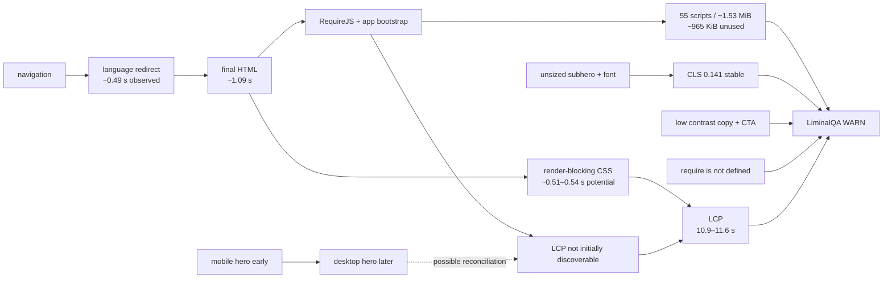

# LiminalQA · Tradernet space-time causality graph

**Target:** `https://tradernet.ru/?site_lang=ru`  
**Independent runs observed:** 2  
**Evidence 1 SHA-256:** `7176dd1ed666c8eddc139850072cf0a5a6729a19a0d4440f4950cb7aa17fa8e3`  
**Evidence 2 SHA-256:** `18a1c19f495a2e53f770b1510fb1baa3732fb17b0f0d10c1f59045653b6c58e8`

## Dominant causal path

`navigation → language redirect → HTML → runtime bootstrap → late LCP discovery → LCP 10.9–11.6 s → WARN`

## Temporal replication

| Signal | Run 1 | Run 2 | Interpretation |
|---|---:|---:|---|
| Performance | 59 | 49 | Degraded in both; timing varies materially |
| FCP | 1.9 s | 2.0 s | Stable early text paint |
| LCP | 10.9 s | 11.6 s | Severe and reproduced |
| TBT | 352 ms | 610 ms | Runtime pressure is variable but persistent |
| CLS | 0.141 | 0.141 | Exact stable visual-instability signature |
| Accessibility | 96 | 96 | Same four contrast failures persist |
| Best Practices | 75 | 75 | Same runtime/browser failures persist |
| SEO | 100 | 100 | Stable pass |
| Unused JavaScript | ~965 KiB | ~965 KiB | Stable payload-overdelivery signature |
| Redirect savings model | ~1.10 s | ~1.17 s | Stable redirect penalty |

Two runs are enough to reject the idea that the overall warning was a one-off, but not enough to establish a production percentile or regional SLA.

## Ranked causes

| Rank | Cause | Status | Evidence | Next discriminating test |
|---:|---|---|---|---|
| 1 | Late LCP discovery | CONFIRMED | LCP image is absent from the initial request graph and lacks `fetchpriority=high`; it dominates the simulated LCP phase. | Put the responsive LCP image in initial HTML and rerun at least 3 times. |
| 2 | JavaScript overdelivery | CONFIRMED | 55 script requests, ~1.53 MiB transfer and ~965 KiB estimated unused in both runs. | Compare with a landing-only bundle. |
| 3 | Language redirect | CONFIRMED | ~489 ms observed and ~1.10–1.17 s modelled mobile savings. | Serve or link directly to the canonical language URL. |
| 4 | Responsive hero reconciliation | PARTLY CONFIRMED | Mobile and desktop hero assets are both transferred; the later desktop asset becomes LCP on a mobile viewport. | Capture DOM mutations and resource initiator stacks. |
| 5 | Render-blocking CSS | CONFIRMED | Two critical stylesheets, ~0.51–0.54 s modelled savings. | Inline critical CSS and defer the remainder. |
| 6 | Image dimensions and font timing | CONFIRMED | CLS is exactly 0.141 in both runs; shifts point to an unsized subhero image and font loading. | Add dimensions/aspect-ratio and test font loading. |
| 7 | RequireJS ordering race | HYPOTHESIS | `require is not defined` appears consistently in the public document path. | Inspect source order and prove whether a visible action fails. |

## Spatial map

| Layer | Confirmed problem | User effect |
|---|---|---|
| Edge/navigation | Language redirect | Delays every cold visit before useful HTML |
| Document head | Render-blocking stylesheets | Delays visual construction |
| Runtime/main thread | Broad bundles, RequireJS and variable long tasks | Transfer waste and unstable responsiveness |
| Responsive media | Both mobile and desktop hero variants load | Extra bytes and probable late reconciliation |
| Above the fold | LCP 10.9–11.6 s plus low-contrast copy/CTA | Slow and less readable first impression |
| Below the fold | Unsized image and font request | Reproducible layout shift |
| Third parties | Analytics transfer, CPU, cookies and blocked Yandex WS | Additional runtime noise, not the dominant LCP cause |

## Navigation timeline

| Event | Approximate time | Evidence class |
|---|---:|---|
| Redirect completes | ~489 ms | observed request trace |
| Final HTML completes | ~1,089 ms | observed request trace |
| Mobile hero request begins | ~987 ms | observed request trace |
| Desktop/LCP hero request begins | ~2,099 ms | observed request trace |
| Font request begins | ~2,111 ms | observed request trace |
| LCP | 10,866–11,600 ms | simulated mobile metric across runs |

## Concrete defects

- Runtime: `ReferenceError: require is not defined` from inline page logic.
- Accessibility: four contrast failures, including the primary CTA.
- Payload: 55 script requests and ~965 KiB estimated unused JavaScript.
- Responsive media: both mobile and desktop hero variants transfer in one mobile navigation.
- Layout: the same CLS value, 0.141, reproduced in both runs.

## Proven vs hypothesis

**Confirmed:** redirect cost, non-initial LCP discovery, duplicate hero transfer, unused JS, render-blocking CSS, console error, layout-shift causes and contrast failures.

**Bounded hypotheses:** hydration replaces the mobile hero with the desktop hero; the RequireJS error breaks a user-facing action; the exact timings generalize across regions and days.

## LiminalQA reflection

The server is not the primary bottleneck in these traces. The highest-leverage sequence is:

1. remove the navigation redirect;
2. expose the correct responsive LCP image in initial HTML with explicit dimensions and high priority;
3. separate the public landing bundle from the trading application bundle;
4. fix image dimensions, font behavior and CTA contrast;
5. investigate the RequireJS ordering error as a separate functional bug candidate.

> Passive public-page quality evidence only. No authentication, trading operation, fuzzing, load testing, private data access or vulnerability claim.
