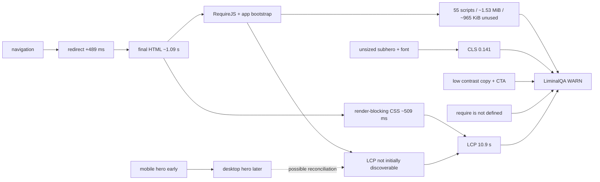

# LiminalQA · Tradernet space-time causality graph

**Target:** `https://tradernet.ru/?site_lang=ru`  
**Evidence SHA-256:** `7176dd1ed666c8eddc139850072cf0a5a6729a19a0d4440f4950cb7aa17fa8e3`  
**Runs:** 1

## Dominant path

`navigation → redirect → HTML → runtime bootstrap → late LCP discovery → LCP 10.9 s → WARN`

## Ranked causes

| Rank | Cause | Status | Why | Next test |
|---:|---|---|---|---|
| 1 | Late LCP discovery | CONFIRMED | Not in initial request graph; no fetchpriority=high; 83% simulated LCP phase. | Put the responsive LCP image in initial HTML and rerun 3 times. |
| 2 | JavaScript overdelivery | CONFIRMED | 55 scripts, ~1.53 MiB, ~965 KiB estimated unused. | Compare against a landing-only bundle. |
| 3 | Language redirect | CONFIRMED | 489 ms observed; ~1.1 s modelled savings. | Serve/link directly to canonical language URL. |
| 4 | Responsive hero reconciliation | PARTLY CONFIRMED | Both variants load; later desktop asset is LCP on mobile. | Capture DOM mutations and initiators. |
| 5 | Render-blocking CSS | CONFIRMED | Two critical stylesheets; ~509 ms modelled savings. | Inline critical CSS and defer the rest. |
| 6 | Image dimensions and font timing | CONFIRMED | Two shifts tied to unsized subhero and font. | Add dimensions/aspect-ratio; test font-display. |
| 7 | RequireJS ordering race | HYPOTHESIS | Inline code reports require undefined. | Inspect source order and add a runtime guard test. |

## Space map

| Layer | Problem | Effect |
|---|---|---|
| Edge | Language redirect | Delays every cold visit |
| Document | Blocking CSS | Delays visual construction |
| Runtime | Broad bundles + RequireJS | Transfer and CPU waste |
| Responsive media | Both hero variants load | Extra bytes; possible late reconciliation |
| Above fold | Late hero + contrast failures | Slow and less readable first impression |
| Below fold | Unsized image + font | Layout shifts |

## Time facts

| Event | Time | Class |
|---|---:|---|
| Redirect completes | ~489 ms | observed |
| Final HTML completes | ~1,089 ms | observed |
| Mobile hero begins | ~987 ms | observed |
| Desktop/LCP hero begins | ~2,099 ms | observed |
| Font begins | ~2,111 ms | observed |
| LCP | ~10,866 ms | simulated mobile metric |

## Concrete defects

- Runtime: `ReferenceError: require is not defined at HTMLDocument.<anonymous> (https://tradernet.ru/?site_lang=ru:75:9)`.
- Contrast failures: **4** elements, including the primary CTA.
- Scripts: **55** requests, **1533.2 KiB**, ~965 KiB estimated unused.
- Both mobile and desktop hero variants transfer in one mobile navigation.

## Proven vs hypothesis

**Confirmed:** redirect, non-initial LCP discovery, duplicate hero transfer, unused JS, blocking CSS, runtime error, layout causes, contrast failures.

**Hypotheses:** hydration replaces the hero; RequireJS error breaks a visible action; timing is stable across days/regions/runs.

## Reflection

The server is not the main bottleneck in this trace. Highest leverage: remove the redirect, expose the correct responsive LCP image in initial HTML, and avoid bootstrapping the broad trading application before landing content stabilizes.

> Passive public-page evidence only. No authentication, trades, fuzzing, load testing, private data, or vulnerability claim.
