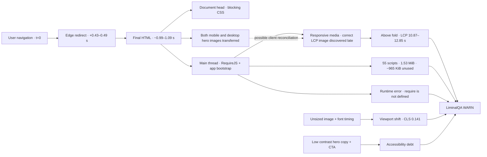

# Tradernet space-time causal analysis

Status: evidence-backed public-page QA analysis from three Lighthouse runs.

## Scope and boundary

Target: `https://tradernet.ru/` with final redirect to `https://tradernet.ru/?site_lang=ru`.

This analysis is limited to passive public web-quality evidence. It does not authenticate, access private data, place trades, fuzz endpoints, perform load testing, or claim a security vulnerability.

## Three-run baseline

| Run | Fetch time UTC | Performance | FCP | LCP | TBT | CLS | Best Practices |
|---:|---|---:|---:|---:|---:|---:|---:|
| 1 | 2026-07-18 20:34:13 | 59 | 1.90 s | 10.87 s | 352 ms | 0.141 | 75 |
| 2 | 2026-07-18 20:54:11 | 49 | 2.04 s | 11.62 s | 615 ms | 0.141 | 75 |
| 3 | 2026-07-18 20:56:49 | 37 | 1.84 s | 12.85 s | 2,741 ms | 0.141 | 75 |

Median values:

- Performance: **49**;
- FCP: **1.90 s**;
- LCP: **11.62 s**;
- TBT: **615 ms**;
- CLS: **0.141**.

The exact performance score and blocking time vary, but the structural signals remain stable: Accessibility 96, Best Practices 75, SEO 100, CLS 0.141, late LCP discovery, large unused JavaScript, language redirect, duplicate responsive hero transfer, contrast failures, and the same `require is not defined` runtime error.

## Space-time causality graph



## Dominant causal path

```text
navigation
→ language redirect
→ final document
→ broad application bootstrap
→ LCP image absent from the initial request graph
→ late responsive image discovery
→ very late largest content
→ degraded first impression and conversion risk
```

## Ranked causes

1. **Late LCP discovery — confirmed.** The LCP image is not initially discoverable and lacks `fetchpriority=high`.
2. **JavaScript overdelivery — confirmed.** About 55 scripts, 1.53 MiB transferred and roughly 965 KiB estimated unused.
3. **Language redirect — confirmed.** Every cold navigation pays an avoidable redirect cost.
4. **Responsive hero reconciliation — partly confirmed.** Both mobile and desktop hero variants transfer; the later desktop variant becomes LCP in a mobile run.
5. **Main-thread contention — confirmed but variable.** TBT ranged from 352 ms to 2,741 ms, showing sensitivity to script execution and runner conditions.
6. **Layout instability — confirmed.** CLS is stable at 0.141, tied to an unsized image and font timing.
7. **RequireJS ordering race — hypothesis for visible impact.** The runtime error is observed, but a broken user action is not yet proven.

## Highest-value next tests

1. Remove the redirect by linking or serving the canonical language URL directly.
2. Put the correct responsive LCP image in initial HTML and add high fetch priority.
3. Run a landing-only JavaScript bundle experiment.
4. Add a DOM-mutation trace to prove whether hydration replaces the hero.
5. Add a browser test that fails on uncaught `require is not defined`.
6. Add explicit dimensions or `aspect-ratio` for shifting media and test font loading.
7. Re-run three times after each isolated change and compare medians, not a single score.

## How the Rust LiminalQA engine accelerates bug discovery

LiminalQA should treat each observation as a typed event rather than a screenshot or prose note:

```text
Run → Signal → Component → Time interval → Evidence hash → Hypothesis → Next test → Verdict
```

### 1. Fast ingestion

Rust runners can ingest Lighthouse, Playwright, API, WebSocket, browser-console, trace, screenshot and CI events concurrently with bounded memory and predictable execution.

### 2. Bi-temporal storage

For every fact, store:

- `valid_time`: when the behavior happened in the tested system;
- `transaction_time`: when LiminalQA learned or changed its interpretation.

This lets the engine answer both:

- “What happened during this navigation?”
- “When did we first learn that this was a recurring defect rather than noise?”

### 3. Causal narrowing

Instead of reading all logs, the engine walks backward from the failure node:

```text
late LCP
← late image discovery
← runtime-controlled responsive media
← broad application bootstrap
← final HTML after redirect
```

The reviewer receives the smallest evidence path that explains the symptom.

### 4. Flake separation

Repeated runs create a stability profile. In this case:

- LCP remains critically slow across all runs;
- CLS and category failures are stable;
- TBT varies strongly.

Therefore LiminalQA can classify late LCP and layout shift as stable product defects, while treating the exact TBT magnitude as environment-sensitive.

### 5. Risk-based test selection

The engine maps changed components to causal descendants:

- redirect/config change → navigation and canonical URL tests;
- hero/template change → LCP, responsive-media and visual tests;
- bundle/runtime change → console, TBT and interaction tests;
- font/image-layout change → CLS and screenshot tests.

Only tests that intersect the changed causal subgraph need to run first. Full regression remains available later.

### 6. Adaptive execution

A practical sequence:

```text
smoke subset
→ inspect signals
→ if stable pass: stop or expand minimally
→ if ambiguous: repeat only unstable tests
→ if regression: run causal neighbours
→ if critical: expand to full affected surface
```

This replaces “run everything and inspect manually” with “run the minimum set that can disprove the current hypothesis.”

### 7. Test closure

A test is closed only when all four conditions hold:

1. the original symptom is absent;
2. the causal predecessor has changed as expected;
3. no neighbouring regression appeared;
4. evidence is bound to the exact build and environment.

A green UI assertion alone is not enough.

## Expected product impact

The main speed gain is not that Rust magically makes browser navigation faster. It makes the surrounding loop faster and more reliable:

- lower-cost concurrent collection;
- deterministic event processing;
- faster causal queries;
- immediate flake/stable classification;
- smaller targeted test sets;
- reusable evidence packets;
- fewer repeated manual investigations.

The target product outcome is:

```text
30–60 minutes of manual triage
→ 1–3 minutes to a ranked causal path and next test
```

That reduction must be measured on real incidents before being claimed as a production benchmark.
