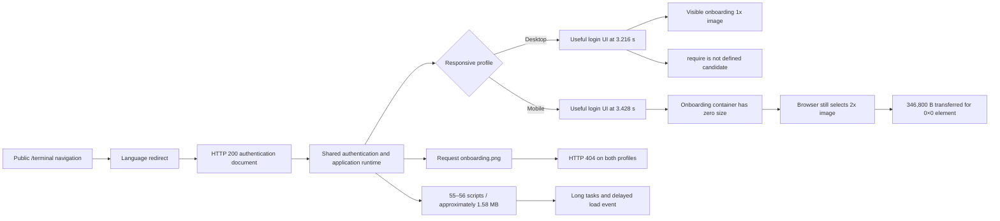

# Tradernet public terminal loading causal audit

## Scope

Public unauthenticated entry:

```text
https://tradernet.ru/terminal
```

The audit performs one cold desktop-broadband navigation, one cold mobile-4G navigation, and one dedicated mobile image-visibility probe. It does not authenticate, submit forms, access portfolio or personal data, call application APIs directly, subscribe to market depth, place orders, fuzz endpoints or load test.

## Executive result

Both profiles return HTTP 200 and consistently resolve to:

```text
https://tradernet.ru/terminal?site_lang=ru
```

The route displays the authentication page rather than the trading terminal. This is expected unauthenticated behavior and is not a defect.

Two first-party loading defects were reproduced on the restacked exact head:

1. the mobile login layout downloads an invisible `2x` onboarding illustration of **346,800 bytes**;
2. both profiles request missing first-party `onboarding.png` and receive HTTP 404.

The desktop-only `ReferenceError: require is not defined` reproduced again, but the authentication form rendered, so user impact remains unproven. Broad JavaScript bootstrap cost also remains a directional candidate rather than a stable latency defect.

## Fresh evidence

### Public terminal loading

- workflow run: `29686656138`
- exact head: `57f5b11039eaab422f0727cb501750c896ae9892`
- artifact: `tradernet-public-terminal-loading-29686656138`
- artifact SHA-256: `1417ea68a65edf369acc4f6888f5abab74ee19058fd087e651fef884d1d11d0e`
- result SHA-256: `3729be3ddf837a00f03b7c7fd4c011f48795cbabe3dd97581d68ed6a56bedc84`

### Mobile image visibility

- workflow run: `29686656131`
- exact head: `57f5b11039eaab422f0727cb501750c896ae9892`
- artifact: `tradernet-terminal-mobile-image-29686656131`
- artifact SHA-256: `89f6f576f7413af3882baa4df0f0d175847f1120b17468afa53aba7818d34ec8`
- result SHA-256: `b47e0e6d086bb56a70c01a0335084fc9c83dd656d4185e5d105a520cc28ae245`

## Space-time causal graph



## Confirmed finding 1: hidden mobile onboarding asset

The fresh mobile DOM contained two image elements:

| Image | Rendered size | Natural size | Transfer | HTTP | Result |
|---|---:|---:|---:|---:|---|
| Logo SVG | 243×32 | 304×40 | 6,296 B | 200 | visible |
| `onboarding.light.2x.png` | **0×0** | 870×870 | **346,800 B** | 200 | loaded but invisible |

The image itself has `display:block`, `visibility:visible` and opacity `1`, but its responsive layout gives it zero rendered size and places it outside the viewport. The browser nevertheless selects the `2x` source and downloads the complete asset.

The asset represents approximately **12.84%** of the measured mobile encoded transfer.

**Verdict:** `HIDDEN_ASSET_WASTE`  
**Severity:** `MEDIUM_PERFORMANCE`

### Recommended fix

- omit the onboarding `<picture>` / `` branch on mobile when the illustration is intentionally hidden;
- alternatively use a media condition that prevents resource selection rather than hiding the selected image;
- use lazy loading only if the image can later enter the viewport; complete omission is preferable for a permanently hidden branch;
- verify with a cold mobile run that the request disappears.

## Confirmed finding 2: missing first-party image request

Both profiles naturally requested:

```text
https://tradernet.ru/images/2022/authorization/onboarding.png
```

The server returned HTTP 404 on both navigations. The responsive light illustration still rendered on desktop, so no visible broken image is claimed.

**Confirmed impact:** redundant first-party request, console error and avoidable diagnostic noise.  
**Severity:** `LOW`

### Recommended fix

Remove or correct the stale reference and add an automated asset-existence check for responsive authentication images.

## Fresh diagnostic loading measurements

One cold run per profile:

| Metric | Desktop broadband | Mobile 4G |
|---|---:|---:|
| First useful authentication UI | 3,216 ms | 3,428 ms |
| FCP | 3,196 ms | 3,428 ms |
| LCP | 3,620 ms | 3,692 ms |
| Load event | 4,357.8 ms | 6,699.3 ms |
| Requests | 72 | 73 |
| Encoded transfer | 2,463,450 B | 2,700,887 B |
| Script requests | 55 | 56 |
| Script transfer | 1,580,814 B | 1,579,829 B |
| Long-task count | 8 | 4 |
| Long-task total | 1,043 ms | 562 ms |

These values are directional laboratory evidence, not stable percentiles. Repeated same-profile runs are required before making a firm latency regression claim.

## Candidate: desktop `require` exception

The fresh desktop run again logged:

```text
ReferenceError: require is not defined
```

The authentication form still rendered and the exception did not appear in the mobile run.

Current verdict: `USER_IMPACT_NOT_ESTABLISHED`.

Next evidence:

```text
three cold desktop runs
→ correlate the exception with auth widget initialization
→ exercise bounded non-submitting login-page interactions
→ prove or reject visible user impact
```

## Candidate: heavy unauthenticated bootstrap

The login state transferred approximately **1.58 MB of JavaScript** across 55–56 script requests. Several bundles are named for orders, instruments and portfolio entities.

Bundle names alone do not prove that the code executes or blocks the critical path. The next bounded experiment should attribute long tasks to exact script URLs before proposing a defect.

## Rejected or bounded signals

- No trading WebSocket was observed; this is expected before authentication.
- An aborted Google Analytics request is third-party telemetry, not a first-party dependency.
- A CSP error blocks a Yandex telemetry WebSocket; no product impact is established.
- The login wall itself is expected unauthenticated behavior.
- The two asset findings are reproduced; latency values remain single-run diagnostics.

## Workflow and authority boundary

The clean restack contains exactly seven intended files. Both workflows target `main`, use `contents: read`, disable persisted checkout credentials and validate the complete public/no-auth/no-data/no-orders/no-fuzzing/no-load/no-active-security contract before launching Chrome.

This audit supplies evidence and recommendations only. It grants no ownership, approval, external-submission or automatic merge authority.
