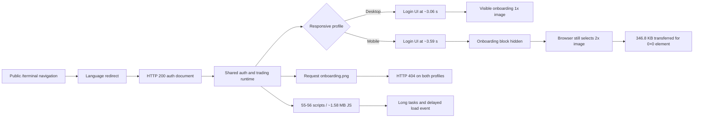

# Tradernet public terminal loading causal audit

## Scope

Public unauthenticated entry:

```text
https://tradernet.ru/terminal
```

The audit uses one cold desktop-broadband navigation and one cold mobile-4G navigation. It does not authenticate, submit a form, access portfolio data, call application APIs directly, subscribe to market depth or perform financial operations.

## Executive result

The public route returns HTTP 200 on both profiles and redirects consistently to:

```text
https://tradernet.ru/terminal?site_lang=ru
```

Without authentication, the route displays the login page rather than the trading terminal. This is consistent across desktop and mobile and is not classified as a defect.

Two first-party loading defects were confirmed:

1. the mobile login layout downloads a hidden `2x` onboarding illustration of **346,800 bytes**;
2. both profiles request a missing first-party `onboarding.png` and receive HTTP 404.

A desktop-only `ReferenceError: require is not defined` and the broad JavaScript bootstrap remain candidates requiring repeated causal experiments.

## Space-time causal graph



## Confirmed finding 1: hidden mobile onboarding asset

Evidence run: `29663762367`  
Exact head: `3a1e882ddb62278af3ae8aaf2ba637df0fc720de`

The mobile DOM contains two images:

| Image | Rendered size | Natural size | Transfer | Result |
|---|---:|---:|---:|---|
| Logo SVG | 243×32 | 304×40 | 6,296 B | visible |
| `onboarding.light.2x.png` | **0×0** | 870×870 | **346,800 B** | loaded but invisible |

The image has `display:block`, but its responsive container gives it zero rendered size. The browser nevertheless selects the `2x` source and downloads the complete asset.

The wasted image represents approximately **12.84%** of the total mobile encoded transfer measured in the main run.

**Verdict:** `HIDDEN_ASSET_WASTE`

### Recommended fix

- do not render the onboarding `<picture>` / `` branch on mobile when the illustration is intentionally hidden;
- alternatively use a mobile media condition that prevents resource selection rather than hiding the already selected image;
- add `loading="lazy"` only if the asset may later enter the viewport; complete omission is preferable for a permanently hidden element;
- verify with a cold mobile run that the `2x` request disappears.

## Confirmed finding 2: missing first-party image request

Evidence run: `29663675619`

Both profiles naturally request:

```text
https://tradernet.ru/images/2022/authorization/onboarding.png
```

The server responds with HTTP 404. The page still displays the responsive light illustration on desktop, so no visible broken image was confirmed.

**Impact:** redundant first-party request, console error and avoidable diagnostic noise.  
**Severity:** low.

### Recommended fix

Remove or correct the stale reference and add an automated asset-existence check for responsive authentication images.

## Loading measurements

One diagnostic cold run per profile:

| Metric | Desktop broadband | Mobile 4G |
|---|---:|---:|
| First useful authentication UI | 3,061 ms | 3,585 ms |
| FCP | 3,044 ms | 3,588 ms |
| LCP | 3,532 ms | 3,872 ms |
| Load event | 4,347.6 ms | 6,867.4 ms |
| Requests | 72 | 73 |
| Encoded transfer | 2,463,358 B | 2,700,761 B |
| Script requests | 55 | 56 |
| Script transfer | 1,580,822 B | 1,579,681 B |
| Long-task total | 822 ms | 525 ms |

These values are directional laboratory evidence, not stable percentiles. Three repeated cold runs are required before making a firm latency regression claim.

## Candidate: heavy unauthenticated bootstrap

The login state loads approximately **1.58 MB of JavaScript** across 55-56 script requests, including bundles named for orders, instruments and portfolio entities.

This may indicate that the unauthenticated auth page inherits a much broader application bootstrap than it needs. However, bundle names alone do not prove the code is executed or blocks the critical path.

Next experiment:

```text
three cold runs
→ capture long-task attribution
→ map each task to script URL
→ browser-local block one non-auth bundle group
→ compare FCP, LCP and auth readiness
```

## Candidate: desktop `require` exception

The desktop run logged:

```text
ReferenceError: require is not defined
```

at the public terminal document. The authentication form still rendered, and the exception did not appear in the single mobile run.

Current verdict: `USER_IMPACT_NOT_ESTABLISHED`.

Repeat three desktop runs and correlate the exception with tab changes, QR login initialization and form interaction before filing it separately.

## Rejected or bounded signals

- No trading WebSocket was observed. This is expected before authentication and is not a quote-loading defect.
- An aborted Google Analytics request is third-party telemetry, not a first-party terminal dependency.
- A CSP error blocks a Yandex telemetry WebSocket. No product impact has been established.
- The login wall itself is expected unauthenticated behavior and is not a terminal availability defect.

## Evidence index

| Evidence | Run | SHA-256 |
|---|---:|---|
| Desktop/mobile terminal loading | 29663675619 | `19fe1f0515fac24a2c45bb93ec39058d14fe14698478a417af507d1d9729b570` |
| Mobile image visibility | 29663762367 | `7a5ff63a0b9a79ddbe37535046dbfbc6d581a9df9a1b7a54aef82b5521a194c1` |
